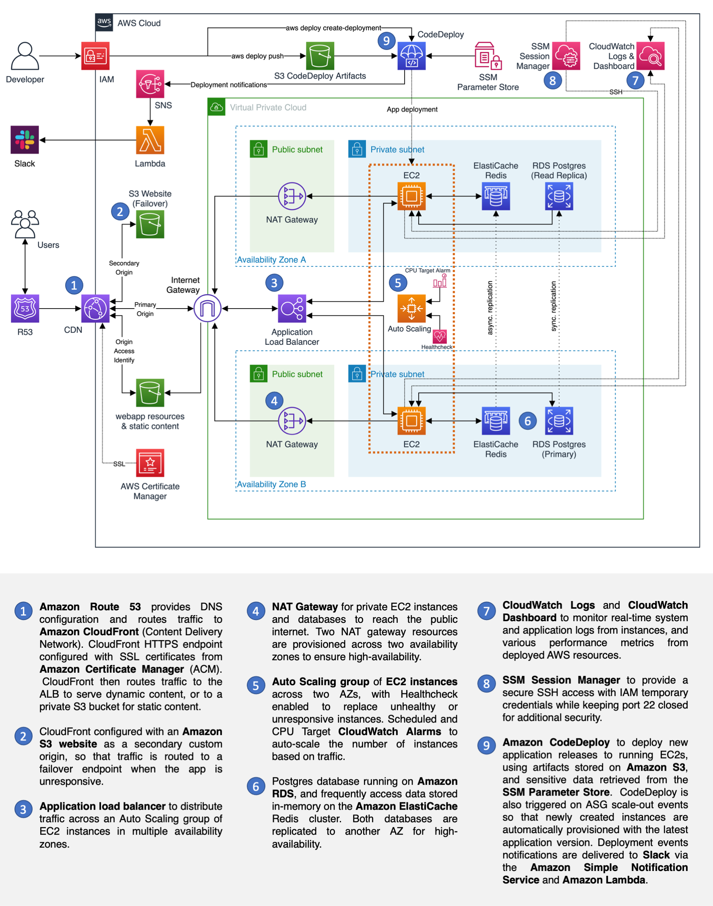
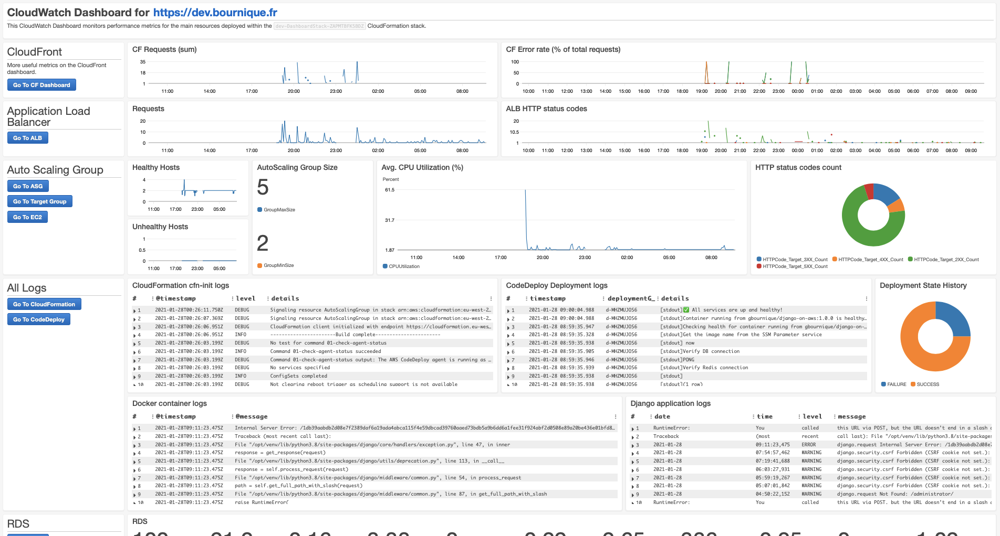
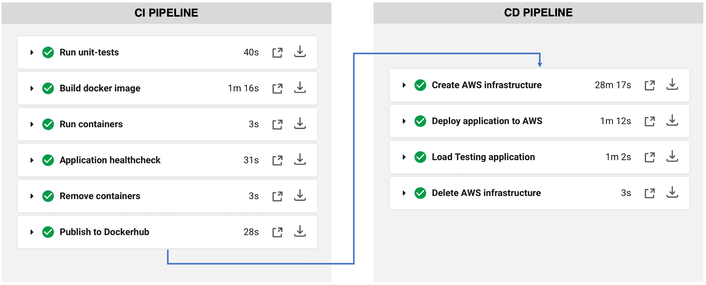

[](https://circleci.com/gh/gbourniq/django-on-aws)
[](https://github.com/pre-commit/pre-commit)


[](https://github.com/psf/black)
[](https://github.com/gbourniq/django-on-aws/blob/master/LICENSE)

## Overview
This repository is a simplified version of https://github.com/gbourniq/portfolio, which previously involved a monolithic application defined by multiple containers deployed on a single server. This new repository implements a microservices approach by using AWS managed services, which will improve performance and maintainability.
- `Nginx` -> `AWS Load Balancer` with SSL certificate
- `Django server` -> `AWS ECS` (previously as docker container on EC2)
- `Redis` -> `AWS ElastiCache` / `AWS DynamoDB`
- `Celery` worker -> `AWS Lambda` & `SQS Queues`
- `Postgres` -> `AWS RDS`

Other improvements compared to the previous version:
- Simplied environment variables and removed all bash scripts
- Removed Ansible / Kubernetes files - Deployment will be managed with CloudFormation
- Address all pylint warnings, improve test coverage and general code improvements

Screenshots of the frontend can be found [here](https://github.com/gbourniq/portfolio/blob/master/README.md#portfolio-app-overview).

## Contents
- [Application development](#local-development)
- [AWS Deployment](#aws-deployment)
- [CI/CD](#cicd)

## Application development

### Prerequisites
- Install [Docker](https://hub.docker.com/search/?type=edition&offering=community)
- Install [Miniconda](https://docs.conda.io/en/latest/miniconda.html) 
- Install [Poetry](https://github.com/sdispater/poetry)
- Install [Make](https://www.gnu.org/software/make/)

### Virtual environment and git-hooks setup

The following make commands are available:
```bash
make env						  <-- Create conda environment and install dependencies with poetry
make env-update                   <-- Update dependencies
make pre-commit					  <-- Install git-hooks hooks (setup once)
```

>> The git-hooks are managed by the [pre-commit](https://pypi.org/project/pre-commit/) package and defined in `.pre-commit-config.yaml`. They will automatically format the code with `autoflake`, `isort` and `black`, and run code analysis and testing with `pylint` and `pytest`, on each commit.

### Run django webserver locally and unit-tests

The following make commands are available:
```bash
make runserver					  <-- Start django webserver (+ spin up postgres and redis containers)
make recreatedb                   <-- Wipe database content
make tests						  <-- Run tests with pytest-django
make open-cov-report			  <-- Open unit-tests coverage html report
```

### Build, test, and publish docker image

The following make commands are available:
```
make image                        <-- Package django application as a docker image
make up                           <-- Start django webserver (docker run), postgres/redis (docker-compose) as containers
make healthcheck                  <-- Ensure django webserver container is up and running
make down                         <-- Stop and remove all containers
make publish                      <-- Push django app docker image to Dockerhub
```

## AWS Deployment

### Create AWS infrastructure from CloudFormation templates



The repository contains nested cloudformation templates so that the application infrastructure shown above can be automatically created from code, using the `awscli`.

>> Note that all AWS resources defined in this architecture *should* be covered by the [AWS Free Tier](https://aws.amazon.com/free/).

Resources are grouped into separate nested (child) cloudformation templates as illustrated below:

```
cloudformation
├── parent-stack.yaml
├── compute
│   └── template.yaml
├── dashboard
│   └── template.yaml
├── database
│   └── template.yaml
├── network
│   └── template.yaml
├── serverless
│   ├── src
│   │   ├── codedeploy_lambda_handler.py
│   │   ├── sns_lambda_handler.py
│   │   └── sqs_lambda_handler.py
│   └── template.yaml
└── storage
    └── template.yaml
```

Prerequisites (manual steps)
- Create Route 53 Hosted Zone ($0.50/month)
- Create a domain in Route53, eg. mydomain.com (~$15/year)
- Create a [free SSL certificate](https://itnext.io/using-letsencrypt-ssl-certificates-in-aws-certificate-manager-c2bc3c6ae10) and load it to the AWS Certificate Manager service in the us-east-1 region 

To deploy all resources as a CloudFormation stack:

1. Review stack parameters in `Makefile` under the `cfn-create` target

2. Run `make cfn-create`

>> Note it can take up to 30mn for all resources to be created. The stack resources can then be updated with `make cfn-create` or deleted with `make cfn-delete`.

### Application deployment to AWS

Deploying the application to a fleet a running EC2 instances is straightforward using the AWS CodeDeploy service.

Application deployment scripts can be found under the `deployment/codedeploy-app/` directory.

```
codedeploy-app
├── appspec.yml					 <-- Used by CodeDeploy to manage deployments
├── scripts
│   ├── 1_stop_server.sh		 <-- Gracefully stop the currently running application
│   ├── 2_before_install.sh		 <-- Preinstall tasks
│   ├── 3_after_install.sh		 <-- Configuration tasks after the new files are copied to the host
│   ├── 4_start_server.sh		 <-- Docker pull the new image and run it
│   └── 5_validate_service.sh	 <-- Ensure new deployment is successful
└── startup_server.sh			 <-- Startup script copied to the host, & mounted to the container
```

Run the `make deploy` command to deploy or update a new version of the application that was pushed as a docker image to Dockerhub. 

>> Note that CodeDeploy is currently set up to update one instance at a time, while keeping a minimum of 50% healthy hosts. Deployment configurations can be found in `deployment/cloudformation/compute/template.yaml` under `# CodeDeploy`.

### CloudWatch Dashboard to monitor application

The `cloudformation/dashboard/template.yaml` template defines the following custom AWS CloudWatch Dashboard.



The dashboard offers a central location where application deployment and performance issues can be investigated through a number of charts:
- CloudFront metrics (requests, % error rate)
- ALB requests and HTTP status codes
- AutoScaling Group Mix/Max/Desired size
- Target Group heatlhy hosts
- Average CPU utilization of running EC2 instances
- Logs: CloudFormation cfn-init, CodeDeploy agent, Docker container, and Django application logs
- RDS and ElastiCache metrics

The conda environment is configured with the `locust` package to run load testing. Run the `make load-testing-ui` command to start the Locust UI and ensure the deployed application can handle "real-world" traffic conditions.


### AutoScaling and cost considerations

The Auto Scaling group as currently defined in the `deployment/cloudformation/compute/template.yaml` template make use of `ScheduledAction` resources to fully scale down the website at night (all EC2 are terminated). 

`ScheduledAction` can achieve significant cost savings by scaling the number of instances appropriately when traffic can be anticipated.

Additionally, a `ScalingPolicy` has been defined to trigger auto scaling events so that the average CPU across all running instances stays around 60% (configurable).


### Disaster recovery and failover

Automated disaster recovery is currently not implemented. For costs reason, it would be a m
* `Recovery Point Objective` is estimated to be around 5mn (RDS automated backup)
* `Recovery Time Objective` is estimated to be around 30mn (time it takes to re-create the whole infrastructure in another region) + minutes to hours for the database recovery

If the website is unavailable, Route53 will failover traffic to an S3 website-enabled bucket reachable behind CloudFront, as illustrated in the Architecture diagram above. This is a simple html page to inform the user:


>> Note the website can be unreachable for two reasons: the AutoScaling Group is fulled scaled down (eg. by ScheduledAction at night), or there is an application failure.


## CI/CD

The `.circleci/config.yml` file configures the following CI/CD pipeline



The CI pipeline only is triggered on every push to the `master` branch, while the full CI-CD pipeline is run on a weekly schedule as configured in the CircleCI file.

The following secret environment variables must be set in the CircleCI project settings
```bash
DOCKER_PASSWORD			<-- to push the built image to Dockerhub (ci pipeline)
AWS_ACCESS_KEY_ID		<-- used by the awscli (cd pipeline)
AWS_DEFAULT_REGION		<-- used by the awscli	(cd pipeline)
AWS_SECRET_ACCESS_KEY	<-- used by the awscli	(cd pipeline)
RDS_POSTGRES_PASSWORD	<-- to create the RDS database and setup Django DB backend (cd pipeline)
```
